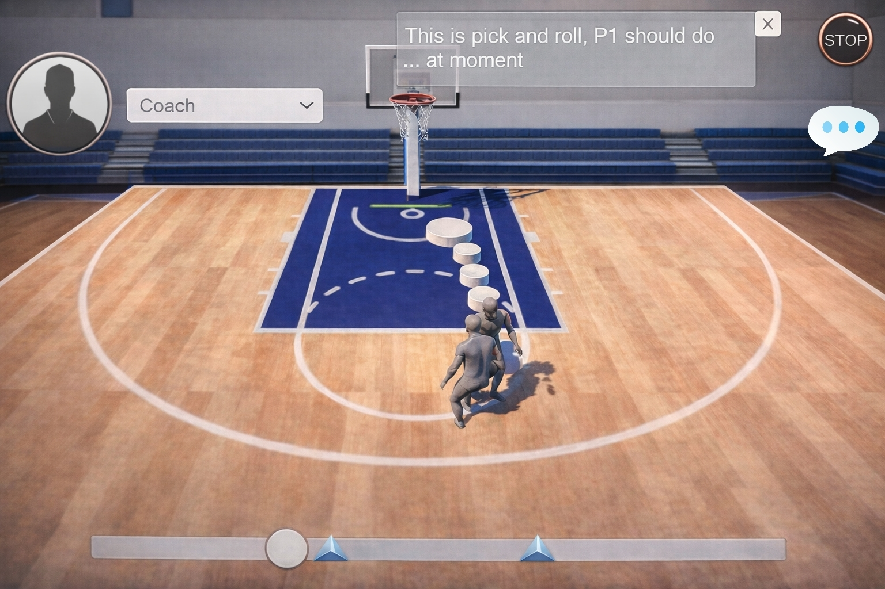

# CoReview: Basketball Tactic Reconstruction and Review System

> An ongoing HCI project that explores how interactive multi-perspective replay can support team-level tactical understanding in basketball post-match review.

## Overview

CoReview is a user- and application-oriented HCI project that investigates how players and coaches can better understand basketball tactics through interactive post-match review.

Grounded in a formative study with players and coaches, we designed and prototyped a system that combines:
- 3D play reconstruction from monocular basketball video
- multi-perspective replay
- visual annotation in Unity

The goal is not only to replay what happened, but to help teams build **Shared Tactical Understanding (STU)** through more spatial, perspective-aware, and interactive review.

---

## Motivation

In real basketball games, tactical communication is often difficult.

Players and coaches may:
- see the same play from very different perspectives
- struggle to explain spacing, timing, and responsibilities using only words or 2D tactical boards
- find it hard to build a shared understanding of team-level intentions

Existing review methods also have clear limitations:
- conventional video replay is passive and perspective-limited
- tactical boards are abstract and lack spatial-temporal realism
- many existing 3D sports systems focus more on individual training than team tactical understanding

This project therefore explores how an interactive review system can better support team-level tactical consensus.

---

## Current Prototype (V1.0)

Our current prototype follows two connected lines.

### 1. From Match Video to 3D Reconstruction
We process monocular basketball video clips and reconstruct the match into a 3D scene through a lightweight pipeline including:
- player / ball detection
- tracking
- pose estimation
- 3D human reconstruction

In the current implementation, we use [**EasyMocap**](https://github.com/zju3dv/EasyMocap) as a practical solution for reconstruction, applying a single-person pipeline multiple times to obtain preliminary multi-player results.

### 2. Unity-Based Interactive Review
Based on the formative study, we designed a Unity prototype that supports:
- **perspective switching** between player and global views
- **visual annotation** for tactical explanation
- integration of reconstructed match content into an interactive review environment

Together, these two lines form our current CoReview prototype.

---

## What the Current System Supports

- interactive post-match replay
- player / coach perspective switching
- visual tactical annotation
- communication around spacing, movement, and responsibilities
- early exploration of team-level shared tactical understanding

---

## TODO

### Reconstruction and Technical Stability
- [ ] Improve the stability of multi-player reconstruction in real basketball footage
- [ ] Improve temporal consistency across frames
- [ ] Reduce identity switching and tracking errors
- [ ] Handle occlusion and player interaction more robustly
- [ ] Explore more stable reconstruction pipelines beyond the current EasyMocap-based prototype

### System and Interaction Design
- [ ] Refine the Unity review interface
- [ ] Improve interaction design for perspective switching and annotation
- [ ] Add richer replay controls and event markers
- [ ] Better support coach-player discussion workflows

### Evaluation and HCI Study
- [ ] Conduct more complete user studies with players and coaches
- [ ] Evaluate how multi-perspective replay affects tactical understanding
- [ ] Investigate how the system supports shared tactical understanding (STU) in team discussion

### Future Directions
- [ ] Explore multimodal LLM support for tactical explanation and “what-if” simulation
- [ ] Extend toward a more robust V2.0 system for tactical review and communication

---

## Acknowledgements

This project was inspired by and built upon several excellent open-source projects and prior efforts, including:

- [roboflow/sports](https://github.com/roboflow/sports)
- [roboflow/supervision](https://github.com/roboflow/supervision)
- [EasyMocap](https://github.com/zju3dv/EasyMocap)
- [4D-Humans](https://github.com/shubham-goel/4D-Humans)  
  *(investigated, but not successfully deployed in our environment yet)*
- [SAM 3](https://github.com/facebookresearch/sam3)
- [CoMotion](https://github.com/apple/ml-comotion)
- [WHAM](https://github.com/yohanshin/WHAM)

We sincerely thank the authors and contributors of these projects for making their work publicly available. EasyMocap is maintained in the `zju3dv/EasyMocap` repository, and 4D-Humans is maintained in the `shubham-goel/4D-Humans` repository. :contentReference[oaicite:1]{index=1}

---

## Contact

Comments, suggestions, and collaborations are always welcome.  
Feel free to open an issue or reach out if you are interested in discussing or building on this project.